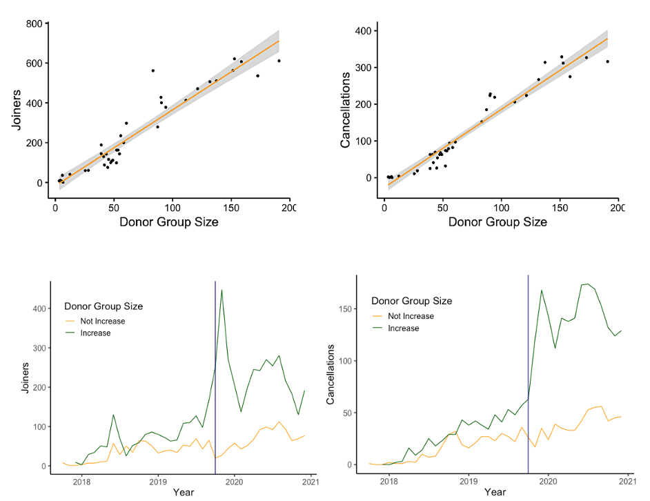
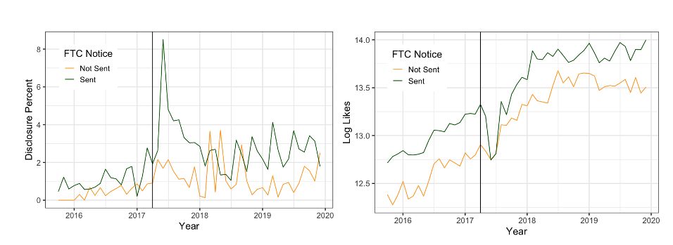

---
header:
  caption: ""
  image: ""
title: Research
type: page
view: 2
---

 
### Popular or Crowded: Subscription Based Donations -JOB MARKET PAPER [Download](https://www.dropbox.com/s/29kao2zqnts8w9x/Popular%20or%20Crowded%20Subscription%20Based%20Donations.pdf?dl=0)
_with Madhu Viswanathan and Pradeep Chintagunta_\
Subscription-based donations are becoming a popular fundraising tool as they are perceived to yield a
high donor lifetime value. A common practice of online donation platforms is to display, for each cause
(e.g., cancer treatment or education provision), the donor group size (number of people donating to
that cause). We use data from a subscription-based donation platform to study the effect of displaying
donor group size on new donors and current donors. We use a) repeat donations of individual donors
and b) an exogenous shock to the platform that shifts the donor group size to identify its impact on
the two donor groups. We find that displaying the number of donors can act as a double-edged sword
— encouraging new donors (a "bandwagon" effect) while discouraging existing donors (a "bystander"
effect) from subscribing. We suggest the managers be careful about displaying the number of donors
as the net effect on subscriptions can vary with the "life cycle" of the charity and its donors. Specifically, managers can leverage this information when new donors signup but should not disclose this
information to current and active donors.

### Regulatory Warnings and Endorsement Disclosure on Social Media [Download](https://www.dropbox.com/s/pe492yqyj2g9lzx/Regulatory%20Warnings%20and%20Endorsement%20Disclosure.pdf?dl=0) 
Social media platforms such as Instagram have become an essential channel for influencer marketing. Regulatory bodies such as FTC (in the US) and ASA (in the UK) require influencers on these platforms to declare an advertised social media post as an ad using hashtags such as #ad, #sponsored. However, often in- fluencers fail to disclose the endorsements. To discourage these unprofessional practices, FTC sent warning notices to 90 influencers in March 2017. We use this event as a natural experiment to estimate the impact of FTC notices on a) influencers’ disclosure levels and b) follower engagement. We curated a novel dataset that consists of nearly 150 thousand Instagram posts over 6 years period. As expected, we find that advertising disclosures increased for the influencers who received the notice, and their follower engagement (likes and comments) was adversely affected. Furthermore, we estimated the deterrence effect of FTC notices on other influencers. We find significant spillover effects on other influ- encers in the FTC jurisdiction. Specifically, the disclosure percent of the influ- encers who did not receive notice also increased compared to the control group. Our findings provide valuable insights to regulators and social media managers on the direct and deterrence effects of regulator notices.

